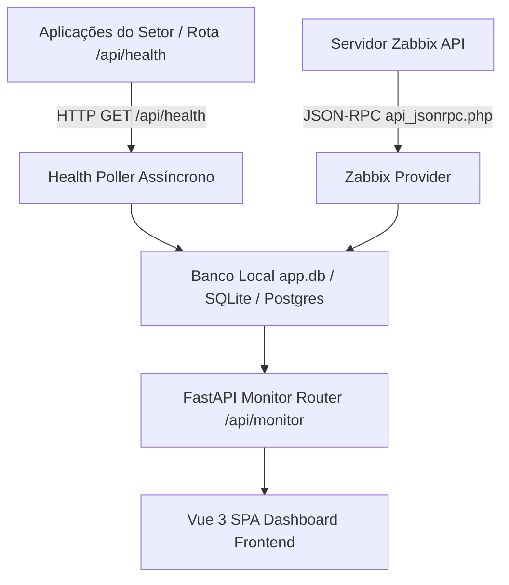

# Design Architecture: Monitora USID

## Arquitetura Geral

O **Monitora USID** estende a arquitetura monolítica assíncrona desacoplada do `Framework-SETISD-HC-UFPE`:

$$\text{Zabbix API / Health Endpoints} \longrightarrow \text{Monitor Resource/Provider} \longrightarrow \text{Monitor Controller} \longrightarrow \text{FastAPI Routers} \longrightarrow \text{Vue 3 Frontend}$$

### Componentes Chave

1. **Health Polling Worker (`src/services/health_poller.py`):**
   - Serviço assíncrono executado em background para sondar endpoints `/api/health` configurados.
   - Armazena histórico no banco de dados SQLite/PostgreSQL e dispara logs de auditoria/alertas em caso de falha.

2. **Zabbix Integration Provider (`src/providers/implementations/zabbix_provider.py`):**
   - Implementa a comunicação com a Zabbix API via JSON-RPC (`httpx`).
   - Mapeia triggers, itens de desempenho e hosts para o formato limpo utilizado no frontend.

3. **Frontend Dashboard Components (`frontend/src/views/DashboardView.vue`):**
   - Componentes visuais modernos: `StatusCard.vue`, `MetricsChart.vue`, `IncidentList.vue`, `SystemHealthGrid.vue`.
   - Atualização periódica (polled refresh) ou WebSocket/SSE para métricas em tempo real.

## Diagrama de Fluxo de Dados

